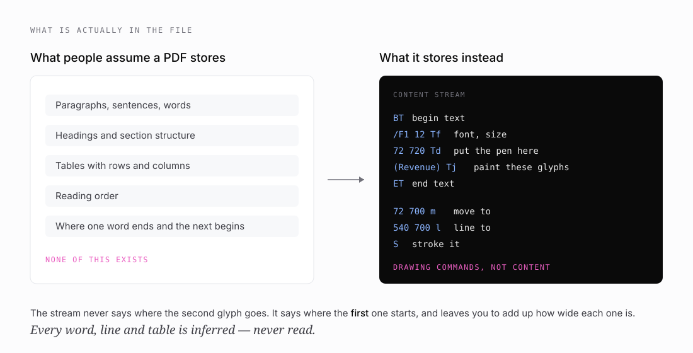

# 1 · A PDF is not a document

*Part one of seven on building [pdftable](https://github.com/hallelx2/pdftable).*



I started building Vectorless on a simple premise: answer questions from documents by reasoning over their structure rather than chopping them into chunks and hoping an embedding finds the right one. That premise needs the structure to survive being read out of the file.

Then I opened a PDF properly for the first time and found there is no structure in there to survive.

## What the file actually holds

A PDF is a program for a printer. Its content stream is a list of drawing commands, and they look like this:

```
BT              begin text
/F1 12 Tf       select font F1 at 12 points
72 720 Td       put the pen at (72, 720)
(Revenue) Tj    paint these glyphs
ET              end text
```

That is the whole model. Move the pen, paint some shapes, move on. The format was designed in 1993 so that a page would print identically on any device, and it succeeded completely at that. Nothing in the design was ever concerned with a machine reading the page back.

Three things you would expect to find are simply absent:

**Words.** No spaces are stored as structure. Many PDFs emit a space *glyph*, but plenty convey a gap by just moving the pen further right. Either way, nothing marks where one word ends.

**Lines.** No line objects, no paragraph objects. Glyphs happen to share a Y coordinate, and you infer a line from that.

**Tables.** Nothing at all. A table is some line segments drawn on the page and some glyphs painted near them. The relationship between them exists only in a human reader's head.

Every one of those has to be reconstructed from geometry. That reconstruction is the entire job of pdfplumber, of pdfminer, and of the library this series is about.

## The consequence that matters

Because the page is a sequence of paint operations, **the file never records where a glyph landed** — only where the pen started and how far each glyph advances.

Position is a running sum:

```
position of glyph N = start
                    + width of glyph 0
                    + width of glyph 1
                    + …
                    + width of glyph N-1
```

Get one width wrong and you have not misplaced one glyph. You have misplaced **every glyph after it on that line**, and the error compounds. Part two is largely about what happens when those widths are wrong, because that is not a hypothetical — it is what pdftable was doing.

## Why this is a retrieval problem, not a formatting problem

It would be easy to file all of this under "cosmetic". The text still comes out roughly right; the coordinates are only for layout.

That is wrong in a way that matters for anything built on top.

Table detection is driven entirely by geometry. pdfplumber's `text` strategy infers column boundaries by looking for words that share an X position down the page, and row boundaries from words that share a Y extent across it. Word bounding boxes are the only input. Drift the boxes and you move the column edges. Move a column edge and cells land in the wrong place. The table handed to a language model is then quietly wrong — plausible, well-formed, and wrong.

At that point the failure is invisible. The model reasons confidently over corrupted input and returns a bad answer, and every layer above the parser looks fine. It reads as *the model got it wrong*. Nobody thinks to check a font metric.

That is the failure mode this whole series is about, and it shaped how I ended up working: **the dangerous bugs in a PDF parser are the ones that do not crash.**

## What sits underneath

pdftable is built on [pdfcpu](https://github.com/pdfcpu/pdfcpu) for the parts nobody should rewrite — xref tables, object resolution, FlateDecode. Everything above that is implemented directly: operator dispatch, graphics and text state, glyph positioning, ToUnicode CMaps, font encodings.

The split is deliberate. Everything except one file is standard-library-only, so if pdfcpu ever needs replacing, the blast radius is a single file.

---

**Next:** [Thinking like a printer](02-thinking-like-a-printer.md) — fonts, advance widths, the fourteen fonts every PDF reader is assumed to know, and the three separate namespaces sitting between a byte in the file and a character on your screen.
