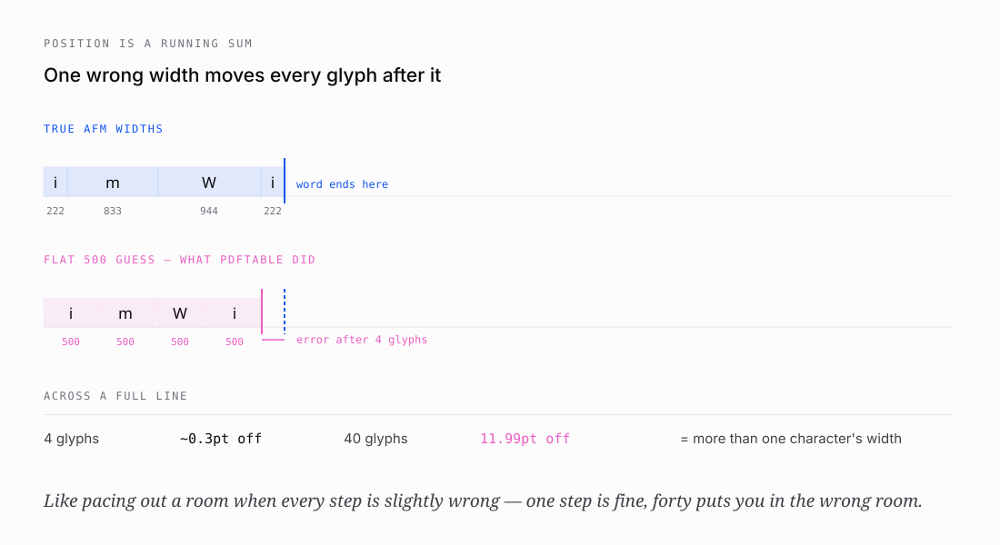
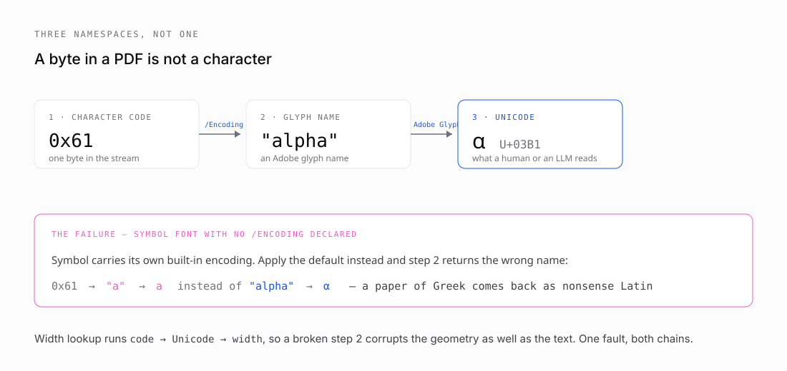

# 2 · Thinking like a printer

*Part two of seven on building [pdftable](https://github.com/hallelx2/pdftable).*



To read a PDF you have to reconstruct what a printer would have done with it. That turns out to be harder than it sounds, because a printer knows several things the file does not bother to tell you.

## Letters are not the same width

In Helvetica, at a font size of 1000 units:

| glyph | width |
| --- | --- |
| `i` | 222 |
| space | 278 |
| `m` | 833 |
| `W` | 944 |

Widths are stored in thousandths of an em so they are independent of size. At 12 point, an `m` advances `833 / 1000 × 12 = 10.0pt`.

A PDF normally ships these in a `/Widths` array on the font dictionary. Normally.

## The fourteen fonts nobody stores

PDF 1.7 §9.6.2.2 exempts fourteen fonts from carrying `/Widths` at all: Helvetica, Times and Courier in four styles each, plus Symbol and ZapfDingbats.

The reason is archaeological. PostScript printers in the 1980s shipped with those fonts burned into ROM, so every device already had the metrics. Storing them again would have wasted bytes on a 300 KB hard disk. The spec encoded that assumption, and PDFs produced this year still rely on it — the 3M annual report I tested against omits `/Widths` throughout.

The bargain is that **the spec offloads the data onto the reader**. Every conforming implementation ships the Adobe Font Metrics tables. pdfminer does. Poppler does. PDF.js does.

pdftable did not. When it found no `/Widths` it fell through to a flat guess:

```go
func (f *Font) CharWidth(cid uint16) float64 {
    if w, ok := f.Widths[cid]; ok {
        return w
    }
    return 500   // half an em, "a reasonable guess"
}
```

Every glyph the same width. `i` and `m` identical. Measured against pdfplumber on real fixtures, that produced **11.99 points of maximum word-position drift** — more than a whole character of accumulated error by the end of a line.

Bundling the real Adobe Core 14 metrics took that to **0.0000pt**. Not approximately; the coordinates match bit for bit.

## The vertical half, which I missed at first

Fixing widths made horizontal positions exact and left vertical positions untouched. The residual was suspiciously tidy:

```
12pt text   off by 2.484pt
24pt text   off by 4.968pt
```

Both are exactly `0.207 × font size`. Helvetica's descender — how far `p`, `g` and `y` hang below the baseline — is −207/1000.

The same exemption that lets those fonts omit `/Widths` also lets them omit `/FontDescriptor`, which is where ascent and descent live. Without it, a glyph's box collapses to `[baseline, baseline + size]` instead of resting on the real descender.

There was a second fault hiding behind the first, and it would have survived fixing it:

```go
descent := font.Descent * 0.001             // before
descent := font.Descent * 0.001 * fontSize  // after
```

Descent is in thousandths of an em, so reaching text space needs *both* factors — the same two the advance width already gets. Without the font size the descender was a fixed fraction of a **point** rather than a fraction of the **glyph**: twelve times too small at 12pt, and wrong for every embedded font that *did* supply a descriptor.

It hid because the one test touching it built its fixture with `Descent: 0`. The broken arithmetic was multiplied by zero.

Columns come from X. **Rows come from Y.** So this one could merge or split table rows, which is a structural failure rather than a cosmetic one.

## Three namespaces between a byte and a character



Text extraction has its own chain, and people routinely collapse three distinct things into one:

1. **Character code** — a byte, 0–255. Meaningless alone.
2. **Glyph name** — an Adobe name (`A`, `alpha`, `a1`). The font's *encoding* maps code → name.
3. **Unicode** — what a human or a model reads. The *Adobe Glyph List* maps name → Unicode.

For ordinary fonts this is dull: `0x41` → `"A"` → `U+0041`.

Symbol breaks it. Symbol carries its own built-in encoding where `0x61` means `"alpha"` → `U+03B1`. pdftable did not know that and applied StandardEncoding, so `0x61` became `"a"`. Any document using Symbol for Greek — most older scientific papers — extracted nonsense.

The two chains then cross. Width lookup runs `code → Unicode → width`, so a wrong Unicode step corrupts the geometry too. One fault, both outputs.

ZapfDingbats has a related but opposite problem. Its glyphs are named `a1` through `a191`, and those names are **not** in the standard Adobe Glyph List — Adobe ships them in a separate file precisely because they are font-specific. So `a1` must mean ✁ *inside ZapfDingbats* and must not mean anything in a Latin font that happens to use the same name in a `/Differences` array. Resolving them globally would silently corrupt any such document.

That distinction is why pdftable keeps two tables: Symbol's names go in the shared resolver because they are genuine AGL entries, and Dingbats' go in a font-scoped one.

## Generating the tables rather than typing them

I was about to transcribe roughly 200 `a1` → `✁` mappings by hand, and stopped.

That is exactly the kind of opaque data where one wrong digit is invisible in review and corrupts extraction permanently. Instead I fetched Adobe's `glyphlist.txt` and `zapfdingbats.txt` and generated the Go tables mechanically. All 190 Symbol names resolved against the AGL with zero misses — which is itself a check that the two sources agree.

The same discipline applied to the vertical metrics, generated from pdfminer.six's `fontmetrics.py` — the same Adobe AFM data, and the implementation being measured against.

Two values in there look like typos and are not: the AGL maps `Delta` to U+2206 INCREMENT rather than U+0394, and `Omega` to U+2126 OHM SIGN. That is what Adobe specifies, matching it is what keeps parity with pdfminer, and both are pinned by a test with a comment so the next reader does not "fix" them.

---

**Next:** [Where tables actually live](03-where-tables-actually-live.md) — why a table has to be inferred, the two strategies for doing it, and what happens to images and vector graphics.
