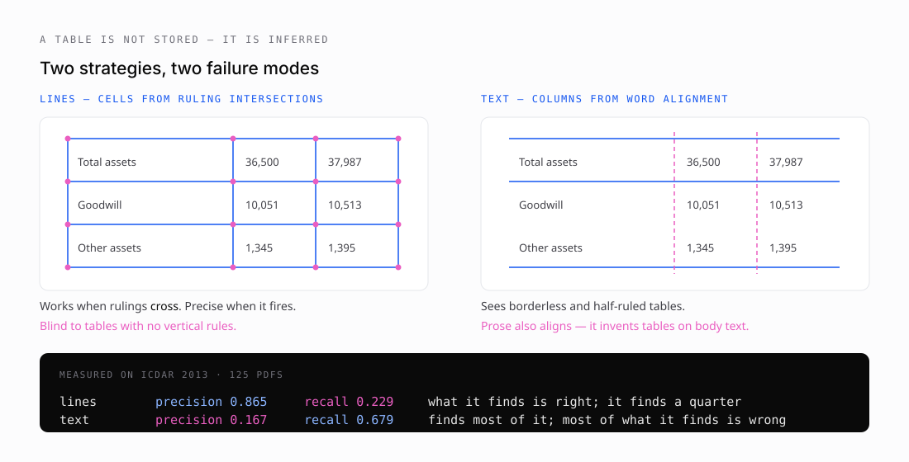

# 3 · Where tables actually live

*Part three of seven on building [pdftable](https://github.com/hallelx2/pdftable).*



There is no table in a PDF. There is no `<table>` tag, no cell object, no row. There is a set of line segments and a set of glyphs, and the fact that a human looking at them sees a table.

So a table extractor is a reconstruction engine, and everything it produces is a hypothesis.

## Two ways to guess

pdfplumber established the two approaches that everything else now uses, and pdftable implements both.

**`lines`** takes the vector graphics the page drew — line segments, rectangle outlines, curve segments that happen to be axis-aligned — and looks for places they *cross*. Each intersection is a potential cell corner. Walk the intersections, find closed boxes, and those are your cells.

**`text`** ignores drawing entirely and clusters word positions. Words sharing an X0 down the page suggest a column boundary; words sharing a vertical extent across the page suggest a row. Cluster, threshold, emit edges.

They fail in opposite directions, and the ICDAR 2013 benchmark makes the shapes obvious:

| strategy | precision | recall |
| --- | --- | --- |
| `lines` | 0.865 | 0.229 |
| `text` | 0.167 | 0.679 |

`lines` is nearly always right and nearly always silent. `text` sees almost everything and is wrong most of the time — because prose has word alignment too, and nothing in the algorithm knows the difference between a table and a paragraph in a narrow column.

## The failure I did not expect

`lines` needs rulings that **intersect**. That sounds obvious until you meet a table ruled only horizontally.

That style — a rule above the header, one below it, one at the bottom, and nothing vertical — is the house style of most government and academic publishing. LaTeX's `booktabs` package exists to enforce it. It looks clean, it is extremely common, and it produces **zero ruling intersections**.

On the ICDAR 2013 corpus, 28 of 125 documents had no table detected at all. Every one was ruled on a single axis:

```
us-017:  218 horizontal rules,   0 vertical
us-018:  226 horizontal rules,   0 vertical
us-024:  135 horizontal rules,   0 vertical
us-025:  225 horizontal rules,   0 vertical
```

The obvious fix is to use rules for one axis and word alignment for the other. pdftable supports mixed strategies per axis, so this needed no new machinery — only automatic selection. Part six covers what happened when I measured it, which was not what I predicted.

## Not everything on a page is text or rules

Two other things show up and both need handling.

**Rectangles.** Many producers draw cell backgrounds as filled rectangles rather than stroking borders. Those four edges look exactly like a table grid to an edge detector — sometimes correctly, sometimes not. pdftable follows pdfplumber in offering `lines_strict`, which uses only genuine line segments and ignores rectangle outlines, for documents where the shading is decorative.

**Curves.** Bezier paths that happen to be axis-aligned are also candidate rulings. A rounded-corner box is a curve, not a rectangle, and dropping it loses a real boundary.

**Images.** An embedded image is opaque. If a page is a scan, there is no text layer at all and every technique in this series has nothing to work with. That is not a gap in the parser; it is a different problem requiring OCR, and part seven covers where that fits.

## The bit that carries citations

Every primitive pdftable reports — glyph, word, line, rectangle, table, individual cell — carries a bounding box in PDF user space. Those coordinates are what make a citation clickable rather than a page number.

That space needs one conversion before a browser can use it. PDF puts the origin at the bottom-left with Y growing up; CSS, canvas, SVG and PDF.js all put it at the top-left with Y growing down. Invert it and the overlay mirrors vertically — which still *looks* plausible, because the boxes land on real rows, just the wrong ones.

pdftable does the flip once, in a tested helper:

```go
r := table.CellsBBox[row][col].Normalized(page.Width(), page.Height())
// {left, top, width, height} as fractions of the page
```

Fractions rather than pixels, so the overlay survives zoom and resizing without recomputation.

Everything is already normalised before that: the MediaBox origin is translated to (0,0) and any `/Rotate` applied, so a rotated landscape page reports coordinates in the space a viewer displays. I verified this end-to-end by rendering a page to an image, projecting real cell boxes onto it, and confirming the highlights landed on the intended rows.

---

**Next:** [Building pdftable](04-building-pdftable.md) — the architecture, the API, and why the whole thing is a deliberate port rather than an invention.
