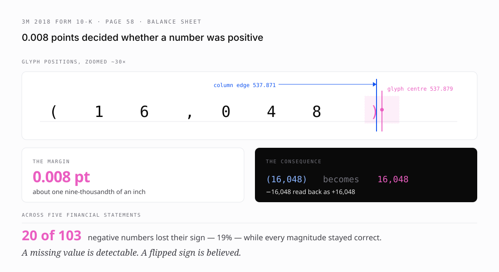

# 5 · The bugs that never crashed

*Part five of seven on building [pdftable](https://github.com/hallelx2/pdftable).*



pdftable had been through four releases, had a green test suite, and produced output that looked correct. It was corrupting financial data.

None of the five bugs below threw an exception. That is what made them expensive.

## 1 · Every letter the same width

Covered in part two. Standard-14 fonts may omit `/Widths`; pdftable guessed 500 for every glyph; word boxes drifted up to 11.99pt.

Fixed by bundling the Adobe Core 14 metrics. Drift went to **0.0000pt**.

## 2 · Greek extracted as Latin

Symbol carries its own encoding. pdftable applied StandardEncoding, so `0x61` decoded as `a` instead of `alpha`.

The metrics for Symbol and ZapfDingbats were bundled but unreachable — 145 of Symbol's 190 glyphs and 201 of ZapfDingbats' 202 resolved to nothing and were discarded at startup. Nothing failed. The data was simply dead.

## 3 · Every glyph box too high

Also part two: no `/FontDescriptor` meant no descender, and a second bug meant the descender was not scaled by font size. Error was exactly `0.207 × size`.

Rows are derived from Y extents, so this one could merge or split table rows.

## 4 · Nineteen percent of negative numbers lost their sign

This is the one that changed how I work.

I pointed the extractor at 3M's 2018 annual report — a real filing, not a fixture. The balance sheet came out beautifully. Every number correct.

Except accounting writes negatives in brackets. `(16,048)` means −16,048.

The closing bracket was being **deleted**:

```
raw text:     Less: Accumulated depreciation   (16,135)  (16,048)
table cells:  | Less: Accumulated depreciation | ( | 16,135) | ( | 16,048 |
```

### The geometry

The `)` glyph spans x = 536.691 → 539.067, so its centre is **537.879**.

The last column's right edge is **537.871**.

It missed by **0.008 of a point** — roughly one nine-thousandth of an inch — and was dropped.

### Why the rule was wrong only at the edge

Cell assignment gives a glyph to whichever cell contains its centre. At an *interior* boundary that is correct: it settles which of two candidate cells owns a straddling glyph, and every glyph still lands somewhere.

At the table's *outer* edge there is no competing cell. The same rule stops disambiguating and starts deleting.

The fix keeps glyphs that merely overlap an outer edge, bounded by the straddling glyph itself so it cannot reach unrelated page content. Interior boundaries are untouched.

### Scale

| statement | negatives | lost |
| --- | --- | --- |
| Income | 4 | 2 |
| Comprehensive income | 9 | 0 |
| Balance sheet | 6 | 3 |
| Changes in equity | 40 | 0 |
| **Cash flows** | 44 | **15** |
| **Total** | **103** | **20 (19%)** |

**Every magnitude was still correct.** Only signs were wrong, which is precisely what made it dangerous. A missing number is obvious. A sign flip on a cash-flow line looks perfect and is completely wrong, and nothing downstream can flag it.

pdfplumber has the same defect on that row. After this fix pdftable is better than the library it is a port of.

## 5 · Small print mashed into single words

Found later, by the expanded test corpus. pdftable dropped space glyphs and inferred word boundaries from gaps alone. At 8pt a space is `278/1000 × 8 = 2.22pt` — under the 3pt tolerance — so a whole line collapsed:

```
pdftable    "Wimillegible3,142(16,048)"
pdfplumber  'Wim' 'illegible' '3,142' '(16,048)'
```

pdfplumber's own gap test would not have split there either (`90.22 > 87.99 + 3` is false), which proves it split on the space *glyph*. It ends a word **at** whitespace before any gap test runs.

Body text in real documents is routinely 8–9pt. This was quietly mangling small print everywhere.

## The finding that was wrong

Extraction returns `"Consolidated Balance Shee t"` for that page heading. I filed it as a bug and speculated about letter-spacing handling.

It is not a bug. That gap is **in 3M's document**. The rendered page shows it and poppler extracts it identically — the filing agent typeset it that way, which is common in SEC EDGAR documents.

The mistake was methodological. I had been comparing pdftable's *table* output against pdftable's *own text* output. Internal agreement tells you the two code paths disagree; it cannot tell you which one is right. I was marking my own homework.

Checking properly meant three independent sources: the page rendered to an image and read directly, poppler's `pdftotext`, and pdfplumber. Two findings survived. One did not, and "fixing" it would have meant inventing text the document does not contain.

## Three more I caused and caught the same day

Worth listing, because they show the same discipline working:

1. **A sheared table.** My merge fix worked per-row, so a header band merged while the data rows below did not — rows ended up with different column counts. My tests asserted merged *text* and never checked column counts.
2. **Welded words.** The space-boundary check counted the space glyph itself as adjacent ink, so `millions, except` became `millions,except`.
3. **Then I overcorrected** and blocked every merge. The right rule is narrow: only a space *in the gap* counts.

Every one was caught by looking at real output, not by a green suite.

## What they have in common

None of these crashed. None produced obviously broken output. Every one would have degraded answer quality in a way that looked like a model problem.

A crash gets fixed in an hour because it is loud. A flipped minus sign gets believed.

---

**Next:** [Measuring instead of believing](06-measuring-instead-of-believing.md) — benchmarks, a harness that measured itself, and the number that redirected the project.
