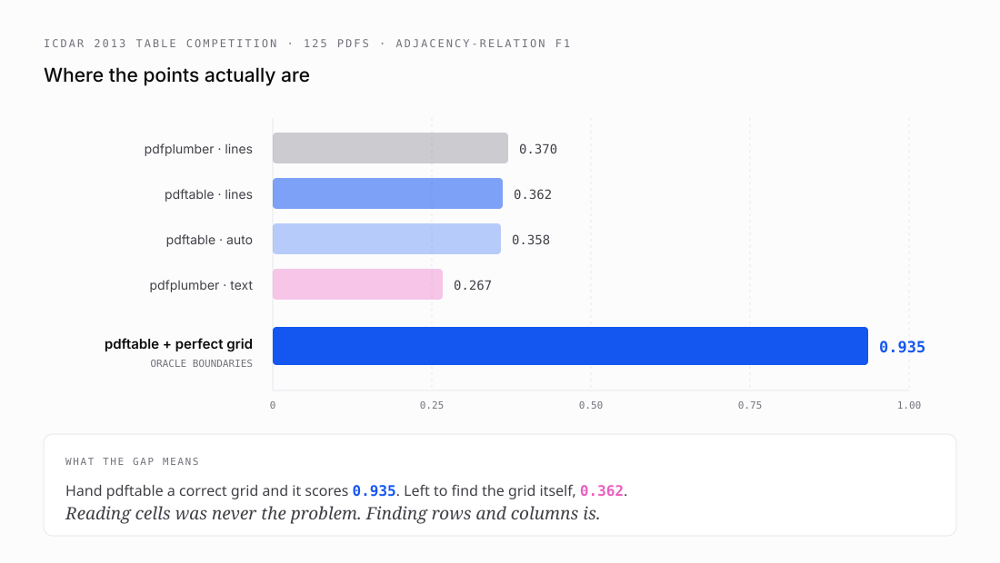

# 6 · Measuring instead of believing

*Part six of seven on building [pdftable](https://github.com/hallelx2/pdftable).*



Four real bugs had survived four releases with a green test suite. So I looked at what the suite actually covered.

**Twenty-six words. One font. Two synthetic files.**

That is a spelling test with two words on it. Passing it proves nothing, and it explains precisely why the font bugs lived so long: nothing was measuring the part that was broken.

There was a second problem, subtler. The tests compared pdftable against numbers I had written down myself. If I was wrong when I wrote them, the test agrees with the wrong answer forever.

## Building an exam

Two things were needed: more questions, and an answer key somebody else wrote.

**More questions.** Fixture PDFs covering all twelve Latin standard fonts at three sizes each — 170 words instead of 26. Three sizes matters: a descender scaled by the wrong *factor* is indistinguishable from a wrong *constant* if you only ever test one size.

The fixtures are built by hand rather than with a PDF library, deliberately. The standard-14 pages carry **no `/Widths` and no `/FontDescriptor`**, which is spec-legal and is exactly the case that hid both metric bugs. A fixture written by reportlab would embed the metrics and quietly test nothing.

**An answer key.** pdfplumber, diffed automatically.

With one rule that matters: **pdfplumber is only the answer key where it is actually right.** For Symbol it returns `abgdep` where the answer is `αβγδεπ`. Generating a golden from it there would permanently pin the wrong answer. Those fixtures get their own assertions instead.

The corpus found a bug within minutes — the 8pt word-merging from part five.

## The real benchmark

Synthetic fixtures test fidelity, not competence. For that I used the **ICDAR 2013 Table Competition** set: 125 born-digital PDFs from EU and US government sources with per-cell ground truth, scored on **adjacency relations** — for each non-empty cell, is the right thing beside it and below it.

That metric exists because a cell-by-cell grid diff is too brittle. Two tools can grid the same table differently — one emits a spacer column, the other does not — and convey identical structure. A grid diff calls that a failure; adjacency asks the question a reader cares about.

| system | precision | recall | F1 |
| --- | --- | --- | --- |
| pdftable (`lines`) | 0.865 | 0.229 | **0.362** |
| pdfplumber (`lines`) | 0.868 | 0.235 | **0.370** |
| pdfplumber (`text`) | 0.167 | 0.679 | 0.267 |

Two readings.

**Parity holds at the table level.** 0.362 against 0.370 with near-identical precision. Everything before this validated *text* fidelity; this is the first measurement of table behaviour, and the port tracks its reference there too.

**Both are weak.** Precision 0.865 says what we extract is right. Recall 0.229 says we miss three quarters of it.

One caveat that matters: **0.36 is not comparable to the 0.85–0.95 in table-structure papers.** Those benchmarks hand the system the table region and score only the gridding. This runs the harder end-to-end task.

## A hypothesis, tested and wrong

The zero-detection documents were all ruled on one axis (part three). Infer the other axis and recall should rise.

I built it, measured it, and it did not work:

| | `lines` | `auto` |
| --- | --- | --- |
| documents with no table found | 28 (22%) | **23 (18%)** |
| tables detected | 306 | **331** |
| F1 | **0.362** | **0.358** |

Detection improved. The newly-found tables were gridded badly, so aggregate F1 went *down*.

That corrected an earlier conclusion of mine. I had written "the bottleneck is detection, not structure", reasoning from precision 0.865 on detected documents — a population **self-selected by being fully ruled**. On the hard ones, structure is weak too.

The feature shipped as opt-in, with the negative result written up, so nobody re-runs the experiment blind.

## The measurement that redirected everything

If the grid is the problem, how good would extraction be with a *perfect* grid? That number decides whether a layout model is worth deploying.

pdftable already had the hook — `StrategyExplicit` takes caller-supplied boundaries — so I fed it the ground-truth grid.

**First result: 0.119.**

With perfect input. Against 0.865 precision on *guessed* boundaries.

That is not a plausible property of the system under test. Perfect input producing eight times worse output means the instrument is bent. The tempting read was "extraction is worse than I thought". The correct read was "my ruler is broken".

### Bug one: every cell edge became a grid line

The naive derivation collects every `x1` and `x2` from every cell box. It fails because **a cell's box hugs its content, not its column**:

```
row 1, col 1:  "Total"                x = 56.7 → 145.0
row 2, col 1:  "Accounts receivable"  x = 56.7 → 210.5
row 3, col 1:  "Cash"                 x = 56.7 → 118.3
```

Column 1's right edge produces a different value on every row. Across 20 rows × 3 columns that is up to **120 distinct x values where the grid has 4 lines**. pdftable built a 120-column grid and shredded every cell into slivers.

The fix uses the ground truth's own logical indices. Each cell carries `start-col` / `end-col`, so a column's extent comes from the cells that *define* it — and only cells that **begin** in column `c` set its left edge, only cells that **end** in `c` set its right edge. A cell spanning columns 1–3 says nothing about column 2's boundaries.

Boundaries are then the outer edges plus the midpoint of each gutter. Using either neighbouring edge alone would systematically clip one side. That yields exactly `ncols + 1` lines.

Rows need the same logic with a twist: **row 0 is the top row, and Y grows upward**, so index order and coordinate order run opposite. Negating on the way in and out lets one function serve both axes.

**0.119 → 0.782.**

### Bug two: scoring against tables I never attempted

Recall was 0.665 while precision was 0.948. That asymmetry is a tell — with perfect boundaries it should not happen.

I excluded multi-table pages, because merging two regions into one edge set recreates bug one. But I scored against ground truth for **every** region in the document, including the pages I had skipped. My own exclusion policy was being counted as extraction failure.

**0.782 → 0.935.** Recall 0.665 → 0.922; precision unmoved, exactly as a denominator fix should behave.

### A hypothesis killed cheaply

I also suspected the ground-truth Y origin might be top-left. Rather than guess, I checked one cell against pdfplumber:

```
'Q1'   GT y1 = 619.0   word y0 = 616.9   flipped would be 211.9
```

2.1 points apart — a box-versus-glyph difference, not a flip. Dead in one command, and I avoided "fixing" something that was never broken.

## The number

| system | precision | recall | F1 |
| --- | --- | --- | --- |
| pdftable, current best | 0.865 | 0.229 | **0.362** |
| **pdftable + perfect grid** | **0.948** | **0.922** | **0.935** |

Given a correct grid, extraction is near-perfect. **Essentially the whole gap is table structure**, not text extraction — every font-metric and sign-preservation fix in this series is real, and none of it is the limiting factor.

### Why I believe 0.935

Precision and recall are balanced; broken harnesses produce lopsided numbers, and mine had 0.113/0.125. It sits below 1.0, which is right — a perfect score would suggest I was comparing ground truth to itself. Each jump has an explanation. And `MergeSplitTokens` *lowers* it, 0.935 → 0.726, which is exactly what should happen: that setting repairs columns a geometric guess cut through, so with a correct grid every merge destroys a good cell. A broken harness would not produce a coherent relationship like that.

That last one was the strongest signal the instrument was finally sound.

---

**Next:** [What is still missing](07-what-is-still-missing.md) — the gaps, the models worth deploying, and the ones that would cost more than they return.
