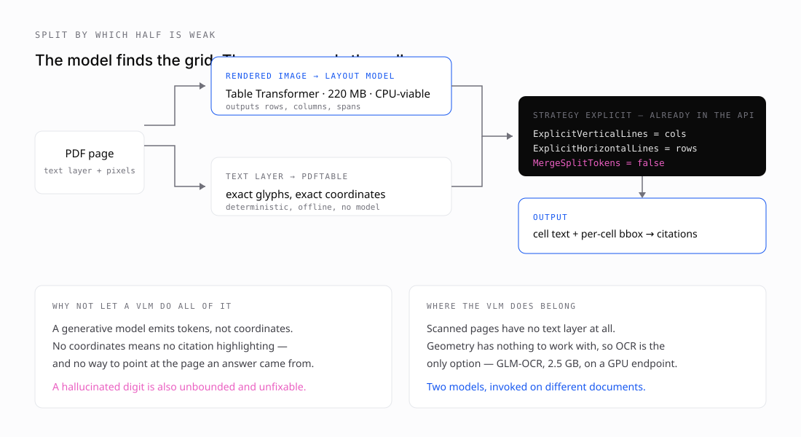

# 7 · What is still missing

*Part seven of seven on building [pdftable](https://github.com/hallelx2/pdftable).*



The measurement in part six settles the roadmap. Reading cells is solved; finding rows and columns is not. Everything below follows from that.

## Where pdftable stands

| | |
| --- | --- |
| Word position drift vs pdfplumber | **0.0000pt**, both axes |
| Negative signs preserved (3M 10-K) | **103 / 103** |
| Fonts exercised end to end | 12, at three sizes |
| Table F1, ICDAR 2013 | 0.362 — level with pdfplumber's 0.370 |
| Table F1 given a correct grid | **0.935** |
| Untested | scanned pages, CJK, embedded subset fonts, multi-table pages |

That last row is the honest caveat. pdftable is measurably good on standard business documents and unmeasured on scans and CJK. Anyone repeating these numbers should repeat that line too.

## The split, decided by measurement rather than taste

Detection is a **vision** problem: where is the table, and where are its rows and columns. Content is a **text-layer** problem: what exactly do the cells say, and where precisely are they.

pdftable is provably better at the second — it preserves accounting minus signs that pdfplumber drops. It is measurably weak at the first. So the sensible architecture uses each for what it is good at:

- **layout model → rows, columns, spans**
- **pdftable → cell contents and coordinates**

No library changes are needed. The hook already exists:

```go
s := pdftable.DefaultTableSettings()
s.VerticalStrategy   = pdftable.StrategyExplicit
s.HorizontalStrategy = pdftable.StrategyExplicit
s.ExplicitVerticalLines   = colBoundaries   // from the model
s.ExplicitHorizontalLines = rowBoundaries
s.MergeSplitTokens = false
tables, _ := page.ExtractTables(s)
```

The caller owns the model call. pdftable stays deterministic, offline and free of network dependencies — which is worth protecting. A parser that quietly makes an HTTP request is a different kind of component.

That `MergeSplitTokens = false` is not a stylistic preference. It is measured: leaving it on drops the oracle result from **0.935 to 0.726**, because the setting exists to repair columns a *geometric guess* cut through a value. Given a correct grid there is nothing to repair, so every merge destroys a correct cell.

## Which model, and why not the obvious one

The instinct is to reach for a document VLM. GLM-OCR is the current standout — 0.9B parameters, MIT licensed, scoring 94.62 on OmniDocBench v1.5 against Gemini 3 Pro's 90.33, and beating it on tables at 86.0 TEDS versus 81.8. A sub-billion-parameter model outperforming a frontier model on document parsing is a real result.

It is still the wrong tool for this job, for three reasons.

**It emits markdown, not coordinates.** A generative model produces tokens. Tokens cannot drive `StrategyExplicit`, and they cannot anchor a citation to a region of a page. Replacing the parser with a VLM means losing the ability to say *where* an answer came from — which for Vectorless is the product, not a feature.

**TEDS 86 is not 99.** That is roughly 14% structural error. On a 57-row balance sheet that is several rows wrong, and you cannot tell which. pdftable given a correct grid scores 0.935 with *deterministic* behaviour — the same input always produces the same output, and a bug is reproducible.

**A hallucinated digit is unbounded.** The sign bug in part five was bad, but it was systematic: one rule, one root cause, one commit, provably zero afterwards. A model that renders 1,292 as 1,232 does it stochastically. You can measure the rate; you cannot eliminate it.

There is a subtler asymmetry too. Geometric parsers **fail loudly and locally** — no rulings found, low fill ratio, obviously misaligned columns. Models fail **uniformly and quietly**: always plausible, occasionally wrong, never flagged. For extraction feeding an answer engine, a failure you can detect beats a lower average error you cannot.

### What to deploy instead

For digital PDFs, a layout model that outputs geometry:

| | weights | params | role |
| --- | --- | --- | --- |
| `table-transformer-detection` | 110 MB | ~28M | finds tables on a page |
| `table-transformer-structure-recognition` | 110 MB | ~28M | rows, columns, spans |
| **both** | **~220 MB** | ~56M | the 0.935 path |
| `GLM-OCR` | 2,528 MB | 0.9B | scanned pages only |

Table Transformer is **23× smaller** than GLM-OCR and, at 28M parameters, CPU-viable. That changes the deployment story completely: no GPU, no separate endpoint, no hourly instance. Both models fit in an existing container alongside the engine. Roughly 0.5–2s per page on CPU, ~50ms on GPU, 55 MB each at fp16.

GLM-OCR still has a place — scanned pages have no text layer, so geometry has nothing to work with and OCR is the only option. But that is a rarer path, invoked per-document rather than per-page, and it can justify a GPU endpoint on its own terms.

Two models on different documents, not one model doing everything.

## The remaining work, in order

1. **Integrate Table Transformer behind `StrategyExplicit`** and measure against the 0.935 ceiling. Expect 0.75–0.85 rather than 0.935 — ICDAR 2013 is out-of-domain for a model trained on PubTables-1M. That gap between ceiling and delivery is the number worth knowing before committing.
2. **Widen the corpus.** No scanned pages, no CJK, no embedded subset fonts. Each is a plausible source of the next silent bug.
3. **Multi-table pages**, excluded from the ceiling measurement and therefore unmeasured.

## What I would tell someone starting this

Three things, in order of how much time they would have saved me.

**The dangerous bugs are the quiet ones.** Everything expensive in this project was silent. A crash gets fixed in an hour. A flipped minus sign gets believed, and surfaces two layers up as *the model is bad at maths*.

**You cannot validate a system from inside itself.** Comparing pdftable's tables to pdftable's own text found a real bug and invented a fake one, and gave no way to tell them apart. The fix was three external references: a rendered page, poppler, pdfplumber. Any fidelity claim needs an oracle you did not write.

**When a measurement disagrees violently with expectation, suspect the measurement.** It happened twice. The descender error looked like noise until `0.207 × size` gave it away. The oracle harness looked like a catastrophic parser failure and was my own grid derivation. Getting the second one backwards would have meant reporting 0.119 and concluding the hybrid was not worth building — when it is worth 0.94.

---

*Full evaluation reports, with commits, oracles and caveats, are in [`docs/evaluations/`](../evaluations/). Benchmarks that download their own datasets are in [`bench/`](../../bench/).*

**Back to:** [the series index](README.md)
