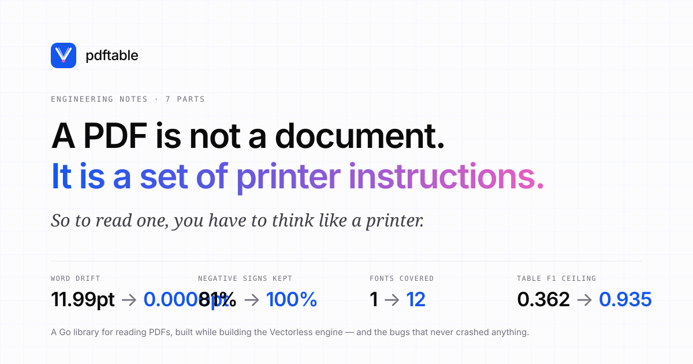

# Reading a PDF like a printer

A seven-part account of building [`pdftable`](https://github.com/hallelx2/pdftable), a Go library for reading PDFs, written while building the Vectorless engine — and of the bugs it turned out to have, none of which ever crashed anything.

The series is written to be read in order, but each part stands alone.

| # | Part | What it covers |
| --- | --- | --- |
| 1 | [A PDF is not a document](01-a-pdf-is-not-a-document.md) | What a PDF actually contains, and the three things it does not |
| 2 | [Thinking like a printer](02-thinking-like-a-printer.md) | Fonts, advance widths, the standard 14, and the three namespaces between a byte and a character |
| 3 | [Where tables actually live](03-where-tables-actually-live.md) | Why a table is inferred rather than read, the two strategies, images and vector graphics |
| 4 | [Building pdftable](04-building-pdftable.md) | The architecture, the API, and why it is a port rather than an invention |
| 5 | [The bugs that never crashed](05-the-bugs-that-never-crashed.md) | Five silent corruptions, including 0.008 of a point that flipped the sign of a financial number |
| 6 | [Measuring instead of believing](06-measuring-instead-of-believing.md) | Benchmarks, a broken harness, and the number that changed the plan |
| 7 | [What is still missing](07-what-is-still-missing.md) | The gaps, the models worth deploying, and the ones that are not |

## The short version

If you only read the numbers:

| | before | after |
| --- | --- | --- |
| Word position drift vs pdfplumber | 11.99pt max | **0.0000pt**, both axes |
| Negative numbers keeping their sign | 83 of 103 | **103 of 103** |
| Fonts exercised by the test suite | 1 | **12**, at three sizes |
| Table F1 (ICDAR 2013, end to end) | — | 0.362, level with pdfplumber's 0.370 |
| Table F1 given a correct grid | — | **0.935** |

The last two lines are the ones that redirected the project. Reading cells was never the weak part.

## Reproducing anything here

Every number has a dated report in [`docs/evaluations/`](../evaluations/) stating the commit it ran against, the external reference used as an oracle, and what it is **not** comparable to. Benchmarks live in [`bench/`](../../bench/) and download their own datasets.
